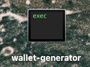

# Core Blockchain ICAN Wallet Generator

### Start the application

> Application is build for macOS and Linux systems with x86-64 architecture.

1. Download latest [Release](https://github.com/core-coin/wallet-generator/releases) for your system.
   - `darwin-x86_64.zip` = macOS
   - `linux-x86_64.zip` = Linux
1. Grant permissions:
   - Via terminal: `chmod 700 wallet-generator`.
   - Via properties of the file: Right click on File -> Properties -> Permissions -> Execute.
1. Start the application:
   - Via terminal: `./wallet-generator`.
   - Via GUI: Double click on it.
1. Application will start in your predefined browser automatically on address: `http://localhost:8080`.

If you follow all steps, you should see executable file.

### Security warnings

#### On the macOS systems

Mac systems have notice of the unsigned applications.

If you get the warning message as following:

Please, visit your `System Preferences > Security & Privacy > General tab` and allow the application.

### Security recommendations

Make sure you:
- Download the application from official [release page](https://github.com/core-coin/wallet-generator/releases).
- The application is not modified by third-party.
- Your device is safe and protected by antivirus.
- You are not connected to any communication network not even internet.
- Turn your WiFi and Bluetooth off.
- Disconnect any auxiliary cables, including the ethernet cable.
- Don't expose your monitor to any recording device or public.
- Hide your screen for exposure to windows / open spaces.
- Avoid any software not necessary on your devices.
- Are aware of key-loggers and check for any harmful software before generation of wallet.
- Are aware of phishing and make sure you access application from `http://localhost:8080`

You have to:
- Backup the file or data securely.
- Don't expose the secure data to third-parties.
- Select the correct network, where the wallet should operate.

I am aware of:
- Loosing the data or file means loosing all the funds and connected data.
- If you forgot the password, you will loose the access.

### Liability

THE SOFTWARE IS PROVIDED "AS IS", WITHOUT WARRANTY OF ANY KIND,
EXPRESSED OR IMPLIED, INCLUDING BUT NOT LIMITED TO THE WARRANTIES OF
MERCHANTABILITY, FITNESS FOR A PARTICULAR PURPOSE, AND NON-INFRINGEMENT.
IN NO EVENT SHALL THE AUTHORS BE LIABLE TO ANY CLAIM, DAMAGES OR
OTHER LIABILITIES, WHETHER IN AN ACTION OF A CONTRACT, TORT, OR OTHERWISE,
ARISING FROM, OUT OF, OR IN CONNECTION WITH THE SOFTWARE OR THE USE, OR
OTHER DEALINGS IN THE SOFTWARE.

### License

Released under the [CORE License](LICENSE).
