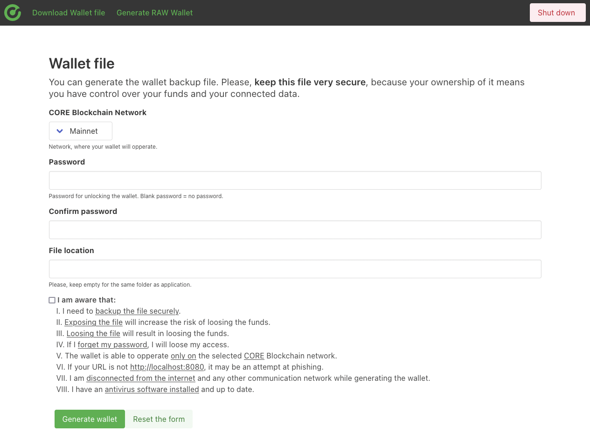
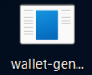
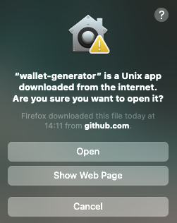
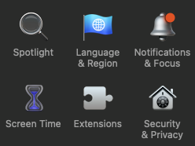
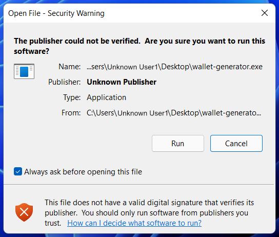

# Core Blockchain ICAN Wallet Generator

### Start the application

> Application is built for macOS, Linux, and Windows systems with x86-64 architecture.

#### Mac and Linux

1. Download the latest [Release](https://github.com/core-coin/wallet-generator/releases) for your system.
   - `wallet-generator-darwin-x86_64` = macOS
   - `wallet-generator-linux-x86_64` = Linux
1. [Open the Terminal](https://support.apple.com/guide/terminal/open-or-quit-terminal-apd5265185d-f365-44cb-8b09-71a064a42125/mac) and navigate to file location. Mostly it is: `~/Downloads` You can change the directory with the command: `cd ~/Downloads`
1. Grant permissions:
   - Via the terminal: `chmod +x wallet-generator-…` or
   - Via the properties of the file: Right-click on File -> Properties -> Permissions -> Execute.
1. Start the application:
   - Via the terminal: `./wallet-generator-…` or
   - Via GUI: Double-click on it.
1. The application will start in your predefined browser automatically at the following address: `http://localhost:8080`.

If you follow all the steps, you should see the executable file.

#### Windows

1. Download the latest [Release](https://github.com/core-coin/wallet-generator/releases) for your system.
   - `wallet-generator-windows-x86_64.exe` = Windows
1. Double-click on the icon.
1. The application will start in your predefined browser automatically at the following address: `http://localhost:8080`.

If you follow all the steps, you should see the executable file.

### Security warnings

#### In the macOS systems

Mac systems notice any unassigned applications.

if you get this warning message:

Please, visit your `System Preferences > Security & Privacy > General tab` and allow the application to launch.

#### In the Windows systems

Windows system will notify you about the `Unknown Publisher`.

`The Publisher could not be verified. Are you sure you want to run this software?`

To proceed press `Run`, otherwise hit `Cancel`.

### Security recommendations

Make sure you:
- Download the application from the official [release page](https://github.com/core-coin/wallet-generator/releases).
- Compare the checksum with the application, you are about to execute. Command: `cat wallet-generator-….checksum | sha256sum --check --status`
- The application is not modified by any third party.
- Your device is safe and protected by antivirus.
- You are not connected to any communication network, not even the internet.
- Turn your WiFi and Bluetooth off.
- Disconnect all auxiliary cables, including the ethernet cable.
- Don't expose your monitor to any recording device or public.
- Don't expose your screen to any windows or open spaces.
- Avoid any unnecessary software on your devices.
- Be aware of key-loggers and check for any harmful software before generating your wallet.
- Be aware of phishing and make sure you access the application from `http://localhost:8080`.

You have to:
- Back up a file or data securely.
- Make sure not to expose the secure data to third parties.
- Select the correct network, where the wallet should operate.

I am aware that:
- Losing the data or the files means losing all the funds and connected data.
- If I forget the password, I will lose access.

### Liability

THE SOFTWARE IS PROVIDED "AS IS", WITHOUT WARRANTY OF ANY KIND,
EXPRESSED OR IMPLIED, INCLUDING BUT NOT LIMITED TO THE WARRANTIES OF
MERCHANTABILITY, FITNESS FOR A PARTICULAR PURPOSE, AND NON-INFRINGEMENT.
IN NO EVENT SHALL THE AUTHORS BE LIABLE FOR ANY CLAIM, DAMAGES OR
OTHER LIABILITIES, WHETHER IN AN ACTION OF A CONTRACT, TORT OR OTHERWISE,
ARISING FROM, OUT OF, OR IN CONNECTION WITH THE SOFTWARE OR THE USE, OR
OTHER DEALINGS IN THE SOFTWARE.

### License

Released under the [CORE License](LICENSE).

*Cryptoni confidimus*
